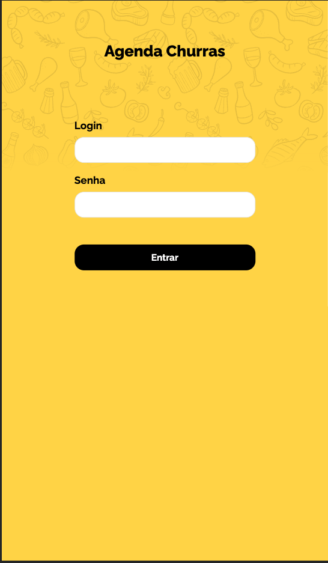
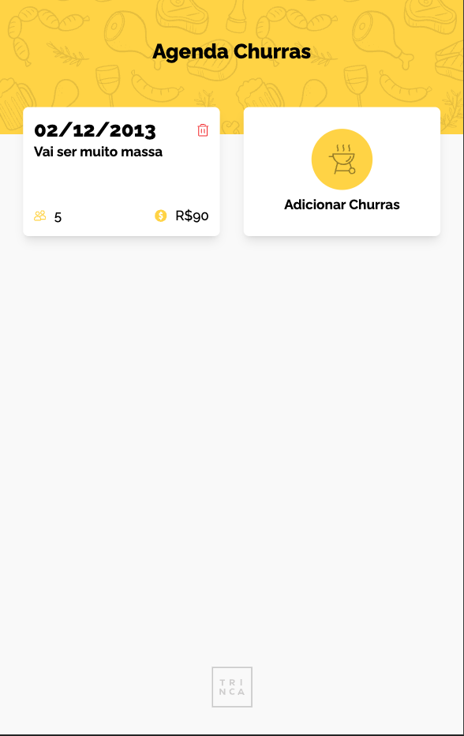
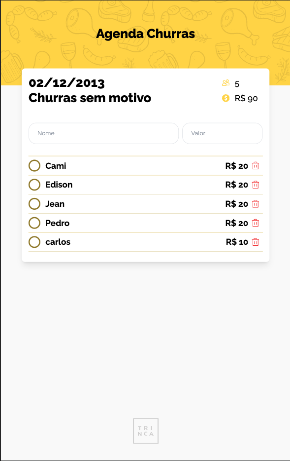

# Churras-trinca

Disponivel em - [Churras-trinca live](https://churras-trinca.cristovao.codes/)

Foi usado `Next-Auth` para controle de sessão. As credenciais se encontram estaticas dentro do projeto em `users.json` apenas para testes, esse arquivo pode ser editado ou usar as credenciais que ja configuradas.

```json
{
  "users": [
    { "login": "trinca01", "password": "semsenha" },
    { "login": "trinca02", "password": "comsenha" }
  ]
}
```

<p align="center">
  
  
  
</p>

## Como rodar

Primero instale os pacotes então rode o servidor local

```bash
yarn install
yarn dev
# http://localhost:3000
```

## Pacotes usados

- Next 13.4
- next-auth
- tailwindcss
- date-fns
- lodash
- react-hook-form
- yup
- react-input-mask
- react-toastify

## Informações relevantes

- O projeto armazena os churras no localstorage, foi criado uma camada de abstração `src/service/{churras e person}` para lidar com isso. caso isso tivesse que ser integrado com alguma api ou BAAS seria muito mais simples só atulaizar os services.

## Dificuldades

- Minha primeira grande decisão foi usar ou não o next com app router (app folder), usando next 13 com app router, nao poderia usar um `chakra` por limitaçoes da propria lib. entao usei o `tailwindcss`
- Iniciei o projeto com `Next 14`, porem tive um problema com `next-auth` que me fez fazer um downground para a 13, afinal muita coisa sem tempo a perder não é :D
- Não entendi muito bem a diferença da descriçao do churras para observaçoes, acabei nao mostrando isso na tela na pagina de detalhes do churrasco.

## Melhorias

- Aproveitaria mais os server side components
- Melhorar as validações de formularios e menssagens de feedback
